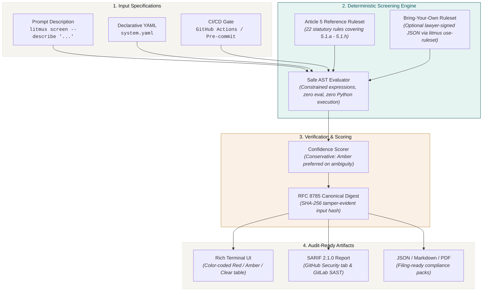

<div align="center">
  <a href="https://aiexponent.com">
    <picture>
      <source media="(prefers-color-scheme: dark)" srcset="https://raw.githubusercontent.com/aiexponent/litmusai/main/.github/brand/logo-full-dark.png">
      <source media="(prefers-color-scheme: light)" srcset="https://raw.githubusercontent.com/aiexponent/litmusai/main/.github/brand/logo-full-light.png">
      
    </picture>
  </a>
  <h1 align="center">LitmusAI</h1>
  <p align="center"><em>Free, deterministic Article 5 screener for the EU AI Act.</em></p>
  <p align="center">
    <a href="https://pypi.org/project/litmus-screener/"></a>
    <a href="https://github.com/aiexponent/litmusai/actions"></a>
    <a href="LICENSE"></a>
    <a href="https://www.python.org/downloads/"></a>
    <a href="https://eur-lex.europa.eu/legal-content/EN/TXT/?uri=CELEX:32024R1689"></a>
    <a href="#privacy"></a>
    <a href="#legal-review-status"></a>
  </p>
</div>

---

> **LitmusAI 1.0.1 ships with the AiExponent reference ruleset (UNREVIEWED — internal panel authored, no external lawyer review). Apache 2.0, AS IS.**
>
> The package's CLI surface, JSON/SARIF schema, and BYO-ruleset contract are stable for production integration. The reference ruleset has been authored and reviewed by an internal AiExponent panel (six engineering + governance roles) but has **not** been reviewed by a qualified EU AI Act practising lawyer. Every screening report carries this disclosure prominently. Customers who require lawyer-reviewed output can supply their own signed ruleset via the BYO mechanism — see [`docs/ruleset-authoring.md`](docs/ruleset-authoring.md).
>
> A full external legal review will land in a `ruleset-2024-1689-v1.1` release with `legal_status: REVIEWED`. Tracked under [Legal review status](#legal-review-status) below.

---

## The Problem

On **February 2, 2025**, Article 5 of the EU AI Act ([Regulation (EU) 2024/1689](https://eur-lex.europa.eu/legal-content/EN/TXT/?uri=CELEX:32024R1689)) entered into active legal enforcement across all 27 EU member states. 

Placing a prohibited AI practice on the market or putting it into service is **strictly illegal** and carries statutory administrative fines of up to **€35,000,000 or 7% of total worldwide annual turnover**.

Most engineering and product teams do not have an in-house EU AI Act counsel to review every model prompt, feature iteration, or system deployment. **LitmusAI** answers one critical question in your terminal or CI pipeline before you deploy:

> *"Is this AI practice prohibited under Article 5?"*

Screen your system against all **eight statutory categories** of Article 5(1)(a)–(h). Receive a per-category **Red / Amber / Clear** verdict with exact legal citations, confidence levels, and concrete remediation advice — in under 60 seconds, completely offline, and without uploading sensitive system descriptions to any third-party server.

Built by [AI Exponent LLC](https://aiexponent.com). Apache 2.0. Runs entirely offline after `pip install`.

---

## Quick Start

```bash
pip install litmus-screener   # the brand is "LitmusAI"; the PyPI distribution is "litmus-screener"
```

```bash
# 1. Quick screen from a plain-text prompt
litmus screen --describe "a chatbot for mental health support for teenagers"

# 2. Or initialize a structured declaration for your system
litmus init                                         # creates system.yaml starter template
litmus screen system.yaml --output report.json      # full 8-category evaluation

# 3. Export audit-ready reports for legal or security teams
litmus export report.json -o report.sarif --format sarif
```

<p align="center">
  
</p>

---

## Why LitmusAI

| Evaluation Method | Cost | Turnaround | Deterministic / Repeatable? | Offline / Zero-Telemetry? |
| :--- | :--- | :--- | :--- | :--- |
| **Big 4 Consulting** | €50K–€150K | 4–8 Weeks | ❌ No (Advisory opinion) | ❌ No (NDAs & data sharing) |
| **Enterprise GRC Platforms** | $40K–$120K/yr | Weeks | ⚠️ Partial | ❌ No (Transfers system specs to cloud) |
| **Internal Spreadsheets** | "Free" | Days | ❌ No (Human error) | ⚠️ Manual |
| **LitmusAI** | **Free (Apache 2.0)** | **< 60 seconds** | **✅ Yes (Deterministic hash)** | **✅ Yes (100% offline, zero network)** |

---

## System Architecture

LitmusAI operates as a deterministic, offline static-analysis pipeline:



---

## What LitmusAI Does

- **Article 5 Full Coverage**: Screens against all 8 prohibited practices under Article 5(1)(a)–(h).
- **Deterministic by Design**: Same input + same ruleset = identical output, guaranteed across platforms.
- **Zero Network Calls (NFR-8)**: 100% offline execution. No telemetry, no telemetry pings, no crash reports. Your architecture and prompts never leave your local machine (enforced in CI via `pytest-socket`).
- **Cryptographic Tamper-Evidence**: Generates a canonical RFC 8785 SHA-256 digest on every report. Verify report integrity anytime via `litmus verify <report>`.
- **Bring-Your-Own-Ruleset (BYO)**: Legal counsel can author, sign, and distribute custom rulesets. Once activated (`litmus use-ruleset`), reports certify `(SIGNED by: Counsel)` rather than `UNREVIEWED`.
- **Multi-Format Export**: Native support for rich console output, machine-readable JSON, Markdown documentation, and SARIF 2.1.0 (with optional PDF via WeasyPrint).

---

## Article 5 Categories Covered

| Category | Prohibition | Statutory Citation | Verdict Logic |
| :--- | :--- | :--- | :--- |
| **5.1.a** | Harmful manipulation & cognitive distortion | Art. 5(1)(a) | **RED** if subliminal techniques + behavioral distortion + physical/psychological harm. |
| **5.1.b** | Exploitation of vulnerable groups (age/disability) | Art. 5(1)(b) | **RED** if targeting minors/vulnerable cohorts + behavioral distortion + harm. |
| **5.1.c** | Social scoring by public or private actors | Art. 5(1)(c) | **RED** if evaluating personality/social behavior + leading to detrimental or disproportionate treatment. |
| **5.1.d** | Predictive criminal risk profiling | Art. 5(1)(d) | **RED** if profiling-based risk assessment solely on personal traits (without human corroboration). |
| **5.1.e** | Untargeted facial image scraping | Art. 5(1)(e) | **RED** if scraping facial images from the internet or CCTV to build facial recognition databases. |
| **5.1.f** | Emotion inference in workplace or education | Art. 5(1)(f) | **RED** in employment or educational institutions; **AMBER** if medical/safety exemptions apply. |
| **5.1.g** | Biometric categorisation of sensitive traits | Art. 5(1)(g) | **RED** if categorising natural persons based on race, political opinions, religion, or sexual orientation. |
| **5.1.h** | Real-time remote biometric identification | Art. 5(1)(h) | **RED** if real-time biometric ID in publicly accessible spaces (subject to narrow judicial exceptions). |

---

## Interactive Artifact Previews

<details>
  <summary><b>📄 View Starter <code>system.yaml</code> Template</b></summary>

```yaml
schema_version: "1.0"
system_id: "customer-support-bot-v1"
name: "Customer Support Assistant"
version: "1.0.0"
description: "AI-driven customer assistant answering technical questions and routing tickets."

lifecycle:
  status: "pre-deployment"
  target_deployment: "2026-10-01"

capabilities:
  emotion_recognition: false
  biometric_identification: false
  subliminal_techniques: false
  social_scoring: false

target_users:
  general_public: true
  minors: false
  vulnerable_groups: false

deployment:
  workplace: false
  education: false
  public_spaces: false
```
</details>

<details>
  <summary><b>🔍 View Audit-Ready SARIF 2.1.0 Output</b></summary>

```json
{
  "$schema": "https://raw.githubusercontent.com/oasis-tcs/sarif-spec/main/sarif-2.1/schema/sarif-schema-2.1.0.json",
  "version": "2.1.0",
  "runs": [
    {
      "tool": {
        "driver": {
          "name": "LitmusAI",
          "version": "1.0.1",
          "informationUri": "https://aiexponent.com/products/litmusai",
          "rules": [
            {
              "id": "litmusai/5.1.b",
              "name": "Vulnerability Exploitation",
              "shortDescription": {
                "text": "Article 5(1)(b) Exploitation of age, disability, or specific social vulnerability"
              },
              "helpUri": "https://aiexponent.com/docs/litmusai/article-5#5.1.b"
            }
          ]
        }
      },
      "results": [
        {
          "ruleId": "litmusai/5.1.b",
          "level": "warning",
          "message": {
            "text": "Conversational agent targets minors experiencing psychological distress without clinician escalation safeguards."
          }
        }
      ]
    }
  ]
}
```
</details>

---

## CI/CD Integration & Exit Codes

Add LitmusAI to your GitHub Actions workflow as an automated pre-merge compliance gate:

```yaml
# .github/workflows/article5.yml
name: EU AI Act Article 5 Screening
on: [pull_request, push]

jobs:
  article5-gate:
    runs-on: ubuntu-latest
    steps:
      - uses: actions/checkout@v6
      - uses: aiexponent/litmusai/.github/actions/litmusai-screen@v1
        with:
          path: system.yaml
          fail-on: amber       # fail CI if overall verdict is RED or AMBER
          output-format: sarif
```

### Exit Code Contract

LitmusAI implements deterministic UNIX exit codes for scripting and CI gates:

| Exit Code | Meaning | CI Behavior |
| :--- | :--- | :--- |
| `0` | **CLEAR / BELOW THRESHOLD** | System passed screening without blocking prohibitions. |
| `1` | **THRESHOLD EXCEEDED** | System triggered a prohibited practice or flagged an unreviewed Amber state. |
| `2` | **SCHEMA / INPUT ERROR** | Malformed `system.yaml`, missing required attributes, or syntax error. |
| `3` | **TAMPER DETECTED** | Hash verification failed (`litmus verify`), indicating report tampering. |

---

## CLI Command Reference

| Command | Description |
| :--- | :--- |
| `litmus screen [path\|--describe]` | Primary screening command (supports file or inline prompt). |
| `litmus init` | Scaffold a starter `system.yaml` template in the current directory. |
| `litmus export <report> -o <file> --format <fmt>` | Convert reports to `json`, `markdown`, `sarif`, or `pdf`. |
| `litmus verify <report>` | Validate cryptographic SHA-256 integrity against the original inputs. |
| `litmus portfolio <directory>` | Batch-screen an entire portfolio of `system.yaml` definitions. |
| `litmus debug <report>` | Print step-by-step rule firing trace and variable evaluation states. |
| `litmus use-ruleset <path>` | Install and activate a custom or lawyer-signed ruleset. |
| `litmus verify-ruleset <path>` | Validate structural integrity and digital signature of a ruleset file. |
| `litmus ruleset-info` | Display metadata, version, and legal review provenance of the active ruleset. |
| `litmus diff-ruleset <old> <new>` | Structural diff between two ruleset versions with breaking-change alerts. |
| `litmus --version` | Display multi-line package version, ruleset version, and legal review status. |

---

## Documentation

- [Getting Started Guide](docs/getting-started.md)
- [Article 5 Statutory Coverage](docs/article-5-coverage.md)
- [Bring Your Own Ruleset (BYO) Guide](docs/ruleset-authoring.md)
- [CI/CD Integration Guide](docs/ci-integration.md)

---

## Important Disclaimers

<a name="legal-review-status"></a>

### Legal Review Status

> **UNREVIEWED REFERENCE RULESET**
>
> The default LitmusAI ruleset (`ruleset-2024-1689-v1.0`) is a good-faith engineering interpretation of Article 5, authored by AiExponent's internal compliance panel. **It has not been reviewed or signed by a qualified EU AI Act lawyer and is not legal advice.**
>
> A full external legal review will land in a future `ruleset-2024-1689-v1.1` release with `legal_status: REVIEWED` and a SIGNED provenance header. The package version (`litmusai 1.0.1`) reflects API and CLI stability — the legal-review status rides on the ruleset version + the explicit `ruleset_legal_status: UNREVIEWED` line printed by `litmus version`.
>
> If your organisation needs a lawyer-signed ruleset today, see [`docs/ruleset-authoring.md`](docs/ruleset-authoring.md) for the BYO-ruleset path. A complete dummy-signed example ships in `tests/fixtures/rulesets/acme-corp-signed-v1.0.json`.
>
> Every screening is a screening, not a certification. **Not legal advice. Not a notified body.**

---

## Privacy & Zero-Network Guarantee

<a name="privacy"></a>

LitmusAI makes **zero network calls** during screening. No telemetry, no usage analytics, no error reporting. Your prompts, proprietary architecture, and system declarations never leave your local machine.

*Enforced in automated CI via `pytest-socket --disable-socket` (NFR-8).*

---

## License

Apache 2.0 — see [LICENSE](LICENSE).

---

*Part of the AiExponent open-source AI governance toolchain:*  
**litmusai** (Art. 5) · 
[license-compliance-checker](https://github.com/aiexponent/license-compliance-checker) (Art. 53) · 
[rag-benchmarking](https://github.com/aiexponent/rag-benchmarking) (Art. 15) · 
[riskforge](https://github.com/aiexponent/riskforge) (Art. 9) · 
[agentic-document-analyser](https://github.com/aiexponent/agentic-document-analyser) (Art. 9 / Annex IV)

---

<div align="center">
  <sub>
    <a href="https://aiexponent.com">aiexponent.com</a> ·
    <a href="mailto:hello@aiexponent.com">hello@aiexponent.com</a> ·
    Built in the open · Apache 2.0
  </sub>
</div>
